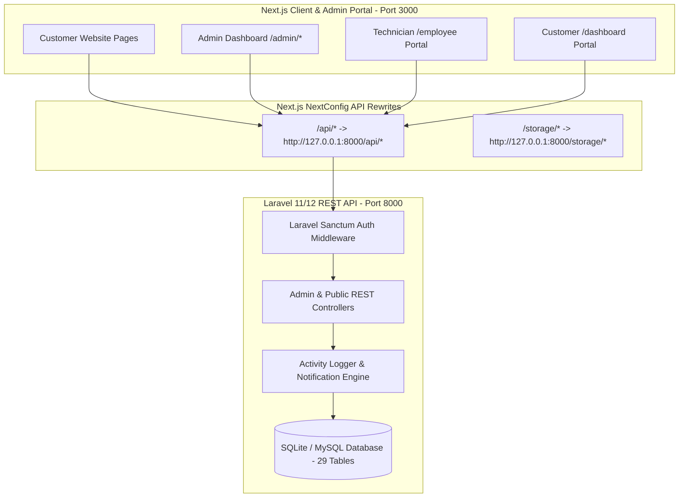

# 🚀 Laravel Backend & Next.js Admin Panel Integration Guide

## 🏗️ Architecture Overview

The backend architecture is built in **Laravel** with Eloquent ORM, Laravel Sanctum authentication, clean RESTful resource controllers, activity audit logging, and automated CORS proxies, while the **Next.js Frontend** (Website & Admin Panel) retains 100% of its styling, design, forms, and UI components.



---

## ⚡ Quick Start

### 1. Launch Both Laravel API & Next.js Frontend
Double-click:
```bash
start-fullstack.bat
```
Or start them individually in two terminals:
- **Laravel Backend**:
  ```bash
  cd backend
  php artisan serve --port=8000
  ```
- **Next.js Frontend**:
  ```bash
  npm run dev
  ```

---

## 🔑 Default Credentials

| Role | Email | Password | Access Level |
| :--- | :--- | :--- | :--- |
| **Super Admin** | `admin@brisbane.com` | `Admin@123456` | Full access to all 27+ Admin modules |
| **Lead Technician** | `tech.marcus@brisbane.com` | `Staff@123456` | Field Technician Job Portal (`/employee`) |
| **Pest Specialist** | `tech.liam@brisbane.com` | `Staff@123456` | Field Technician Job Portal (`/employee`) |
| **Customer** | `sarah.miller@example.com` | `Customer@123456` | Customer Portal (`/dashboard`) |

---

## 📦 Complete Modules Implemented in Laravel

| Module | Route Prefix | Key Functionality |
| :--- | :--- | :--- |
| **Authentication** | `/api/auth/*` | Sanctum Bearer tokens, Login, Registration, Session info (`/me`), Logout |
| **Dashboard** | `/api/admin/dashboard` | Real-time KPI counts, revenue calculations, recent enquiries & bookings |
| **Bookings** | `/api/admin/bookings` | Booking management, status updates, date/timeslot dispatch, price edits |
| **Quotations** | `/api/admin/quotations` | Custom quote approvals with deposit requirement ($50 AUD), rejections |
| **Invoices** | `/api/admin/invoices` | Australian 10% GST calculation, dynamic line items, PDF-ready records |
| **CRM Customers** | `/api/admin/customers` | Customer management, job history, address & contact book |
| **HRM Employees** | `/api/admin/hrm/employees` | Employee codes (`EMP-101`), hourly rates, certified skills, login sync |
| **Attendance** | `/api/admin/hrm/attendance` | Daily check-in, check-out, leave records, work notes |
| **Crew Assignment** | `/api/admin/assignments` | Multi-technician dispatch (1 to 5+ cleaners), lead designation |
| **RBAC Roles** | `/api/admin/roles` | Role permissions matrix, granular access control |
| **Users** | `/api/admin/users` | Admin, staff and customer user management |
| **Lead Enquiries** | `/api/admin/enquiries` | Website contact form leads, notes, status workflow |
| **Services CMS** | `/api/admin/services` | Service catalog, pricing, tabs (residential/commercial), features, SEO |
| **Blogs CMS** | `/api/admin/blogs` | Blog articles, categories, excerpt, rich text, SEO |
| **FAQs CMS** | `/api/admin/faqs` | FAQs with category and service tag association |
| **Pages CMS** | `/api/admin/pages` | Custom schema, meta tags, robots configuration |
| **Testimonials** | `/api/admin/testimonials` | Verified client reviews, 5-star ratings, approval toggles |
| **Media Library** | `/api/admin/media`, `/api/admin/upload` | File uploads, public storage link, mime-type classification |
| **Payment Settings** | `/api/admin/payment-settings` | Stripe, PayPal, PayID (NPP/Osko), POLi, Afterpay, Bank Transfer (EFT) |
| **Orders** | `/api/admin/orders` | Orders, payment tracking, total calculations |
| **Technician Reports** | `/api/admin/reports/technicians` | Technician-to-Customer, Customer-to-Technician, multi-crew stats |
| **Activity Logs** | `/api/admin/activity-logs` | Comprehensive audit trail for every create/update/delete action |
| **Notifications** | `/api/admin/notifications` | Real-time dashboard notification center with mark-as-read |
| **Email Logs** | `/api/admin/emails` | SMTP & email dispatch history and live test tools |
| **WhatsApp Logs** | `/api/admin/whatsapp` | Meta Cloud & Twilio WhatsApp message tracking and test triggers |
| **Homepage CMS** | `/api/admin/homepage` | Dynamic hero, about, cards, CTA phone numbers, and SEO |
| **Communication Settings** | `/api/admin/communication-settings` | Email SMTP, WhatsApp API gateways, live testing |
| **Site Settings** | `/api/admin/settings` | General company info, phone, ABN, email, addresses |
| **Customer Portal** | `/api/customer/*` | Customer quotations, invoices, payment history, notifications |
| **Employee Portal** | `/api/employee/*` | Assigned jobs, status changes, checklist, inspection photos |
| **Public Lead APIs** | `/api/contact`, `/api/bookings` | Instant lead capture and direct booking submission |
| **Cron Jobs** | `/api/cron/reminders` | 48-hour / 2-day pre-booking reminder dispatcher |

---

## 🗄️ Database Configuration

### SQLite (Default - Ready to use out of the box)
The database is located at:
```
backend/database/database.sqlite
```

### Switching to MySQL (XAMPP)
When you start MySQL in XAMPP, open `backend/.env` and update:
```env
DB_CONNECTION=mysql
DB_HOST=127.0.0.1
DB_PORT=3306
DB_DATABASE=carpet_backend
DB_USERNAME=root
DB_PASSWORD=
```
Then run:
```bash
cd backend
php artisan migrate --seed
```
