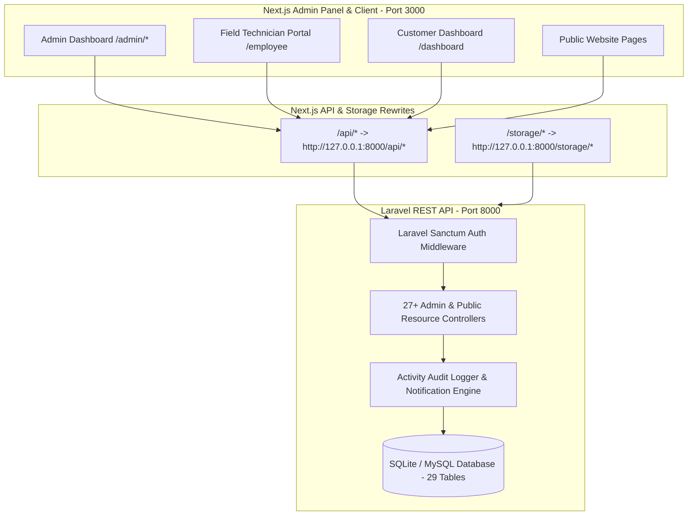

# 🧼 Brisbane Carpet & Pest Experts — Fullstack Enterprise Web Platform & ERP System

An end-to-end, production-ready enterprise web application and field service management system built for Australian carpet cleaning, pest control, and bond cleaning operations in Queensland, Australia.

Built with **Next.js 15 (App Router)** frontend and a robust, scalable **Laravel REST API** backend with Eloquent ORM, Laravel Sanctum token authentication, multi-crew dispatching, and automated PM2 deployment.

---

## 📑 Table of Contents
1. [🌟 System Overview & Key Features](#-system-overview--key-features)
2. [🏗️ Architecture & Decoupled Design](#️-architecture--decoupled-design)
3. [🚀 Quick Start & Local Setup](#-quick-start--local-setup)
4. [🔐 Seed Accounts & Demo Credentials](#-seed-accounts--demo-credentials)
5. [🔄 End-to-End Business Workflows](#-end-to-end-business-workflows)
6. [💳 Payment Gateways & Australian Banking Setup](#-payment-gateways--australian-banking-setup)
7. [📧 Email & 📱 WhatsApp API Configuration](#-email---whatsapp-api-configuration)
8. [🚢 Deployment Guide (VPS, Nginx, PM2)](#-deployment-guide-vps-nginx-pm2)
9. [📡 API Endpoint Reference](#-api-endpoint-reference)

---

## 🌟 System Overview & Key Features

### 1. 👤 Customer Experience (`/register`, `/login`, `/dashboard`)
- **Demand Quotation Engine**: Custom dynamic service requests (Bedrooms, Bathrooms, Sqm, Carpet Steam, Pest Control, Tile Scrub, Bond Clean).
- **Price Approval & Lock-in**: Admin reviews and prices the demand quote; sets standard **$50.00 AUD deposit** to lock the calendar date.
- **Australian Payment Gateways**: Direct online payments via **Stripe**, **PayPal**, **PayID / NPP Instant**, **POLi Internet Banking**, and **Direct Bank EFT**.
- **Customer Dashboard**: Real-time quotation statuses, upcoming bookings, GST tax invoices (PDF/Print view), field job photos, and notification center.

### 2. 🛡️ Super Admin Control Center (`/admin`)
- **Quotation Management** (`/admin/quotations`): Approve prices, set custom deposits, reject with reason, or convert directly to work orders.
- **Multi-Technician Assignment Engine** (`/admin/assignments`): Assign **1 to 5+ field specialists per job** (Lead Specialist, Steam Cleaner, Pest Controller, Bond Cleaner, Quality Inspector).
- **Two-Way Cross-Referenced Reports** (`/admin/reports`):
  - *Technician ➔ Customer*: Full job history, revenue generated, client list, and performance metrics per technician.
  - *Customer ➔ Technician Crew*: Detailed breakdown of which crew members serviced each residential or commercial property.
- **Australian Tax Invoicing & Billing** (`/admin/invoices`): Compliant with the Australian Taxation Office (ATO) with **10% GST breakdown**, ABN (`45 892 103 441`), and payment status tracking.
- **HRM & Field Staff Management** (`/admin/hrm`): Employee profiles, daily attendance tracking, certified skills, and live inspection photo review.
- **Gateway & API Key Manager** (`/admin/payment-settings`, `/admin/emails`, `/admin/whatsapp`): Change production/sandbox keys directly from the browser UI without touching code or restarting servers.

### 3. 📱 Mobile Field Technician Portal (`/employee`)
- **Assigned Job Schedule**: View today's and upcoming jobs with customer address, contact phone, and time slots.
- **Multi-Photo Evidence Upload**: Field technicians upload photos categorized as `BEFORE`, `DURING`, `AFTER`, and `FAULT_EVIDENCE`.
- **Pre-Existing Damage Notes**: Document pre-existing carpet burns, wall stains, or pest infestations with timestamps to eliminate customer disputes.
- **Job Status Transitions**: Update job state in real-time (`SCHEDULED` ➔ `ARRIVED` ➔ `IN_PROGRESS` ➔ `COMPLETED`).

### 4. ⏰ Automated 48-Hour Pre-Booking Reminders (`/api/cron/reminders`)
- Triggers 2 days (48 hours) prior to the scheduled booking date.
- Dispatches multi-channel alerts: **HTML Email**, **WhatsApp / SMS**, and **In-App Dashboard Notification**.

---

## 🏗️ Architecture & Decoupled Design



---

## 🚀 Quick Start & Local Setup

### Single-Click Fullstack Launcher (Windows)
Double-click:
```bash
start-fullstack.bat
```

### Manual Individual Commands
1. **Laravel Backend API**:
   ```bash
   cd backend
   php artisan serve --port=8000
   ```
2. **Next.js Frontend & Admin**:
   ```bash
   npm run dev
   ```

Open **`http://localhost:3000/admin`** in your browser.

---

## 🔐 Seed Accounts & Demo Credentials

| Role | Email | Password | Access Level |
| :--- | :--- | :--- | :--- |
| **Super Admin** | `admin@brisbane.com` | `Admin@123456` | Full access to all 27+ Admin modules |
| **Lead Technician** | `tech.marcus@brisbane.com` | `Staff@123456` | Field Technician Job Portal (`/employee`) |
| **Pest Specialist** | `tech.liam@brisbane.com` | `Staff@123456` | Field Technician Job Portal (`/employee`) |
| **Customer** | `sarah.miller@example.com` | `Customer@123456` | Customer Portal (`/dashboard`) |

---

## 🚢 Deployment Guide (VPS, Nginx, PM2)

### Automated Setup
On your Ubuntu VPS, run:
```bash
sudo bash scripts/setup-server.sh
```

### Automated Deploy
```bash
bash scripts/deploy.sh
```
PM2 will automatically manage and monitor both `carpet-frontend` and `carpet-backend-api`.
